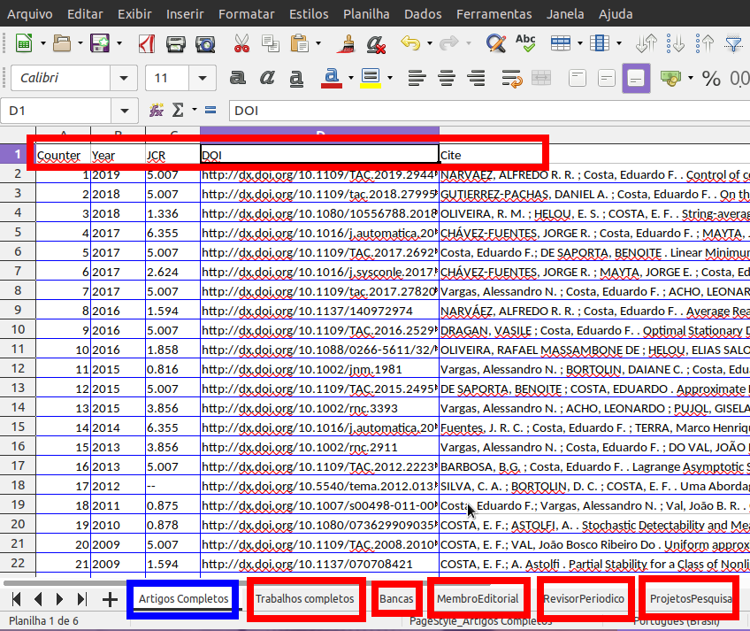

# Tenha o Python 3 instalado

 - Caso ainda não tenha o Python 3 instalado, acesse o site oficial em
    [Python.org](https://www.python.org).

## Como usar
  
  

## Resultado

Segue um exemplo do resultado.

  
  

### Execute com *python3 gui.pyw*

 - Linux: No terminal, execute 
 > **`python3 gui.pyw`**

 - Windows: Apenas dê um duplo clique no arquivo **```gui.pyw```** ou execute **```py gui.pyw```**
    no terminal (CMD ou PowerShell).

### Bibliotecas necessárias
 
As bibliotecas necessárias estão descritas no arquivo **`requirements.txt`**.
Você precisa instalá-las uma única vez no seu computador. Para isso, utilize
o gerenciador de pacotes **`pip`** ou **`pip3`** do python (se você tiver o python2 na 
sua máquina, use **pip3**, senão, apenas **pip** será suficiente).

Você pode fazer no terminal
> **`pip3 install -r requirements.txt`** 

Caso você esteja no Linux e não tenha o **pip3**, pode instalá-lo com
> **`sudo apt-get install python3-pip`**


## Personalizar
Você pode personalizar o comportamento do app apenas alterando o arquivo **`/lattes/mglobal/configs.py`**. 
Como exemplo, você pode alterar as dimensões da tela, e alterar os nomes das planilhas e os nomes das colunas
de cada planilha.
